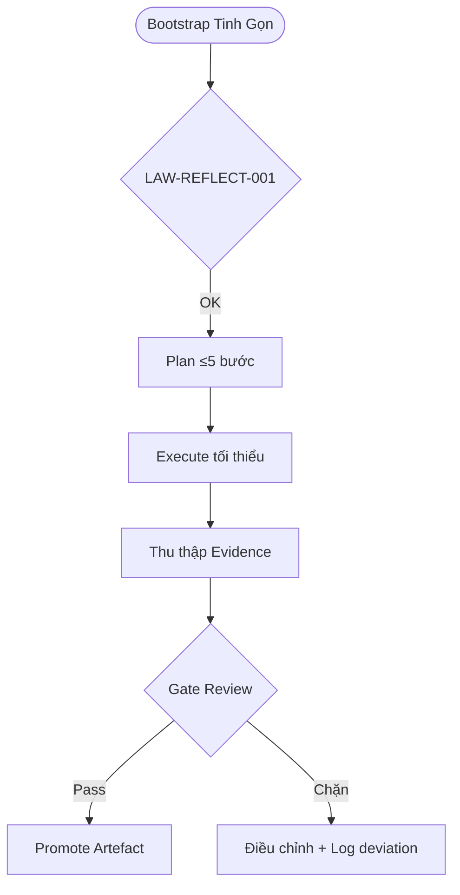

# 🌐 MCP PoC Operations Framework

> Bản thử nghiệm thân thiện với khách hàng, mô phỏng cách vận hành một MCP Server rút gọn mà vẫn bảo toàn bí mật cốt lõi.

## ✨ Tổng quan nhanh
- ✅ **Triển khai đa tác vụ & đa tác nhân**: skeleton Python (`src/mcp_poc_framework`) cho phép đăng ký nhiều agent và phân phối tác vụ theo skill.
- 🔌 **Tích hợp API AA bên ngoài**: adapter HTTP (`integrations/providers.py`) dùng token môi trường, dễ mở rộng sang gRPC/WebSocket.
- 🧱 **SSoT kiểm soát trung tâm**: `SSoTStateStore` lưu assignment/result, đồng bộ với log JSONL để audit.
- 🔒 **Bí mật đảm bảo**: chỉ chia sẻ kiến trúc chiến lược, mọi chi tiết nhạy cảm được thay bằng placeholder `REDACTED` và kiểm tra sanitize.
- 📊 **Artefact chứng minh**: log AA, checklist sanitize, sơ đồ value loop, roadmap Gate và sample workflow.


## 🧭 Sơ đồ vận hành


## 🧱 Kiến trúc repo (rút gọn)
| Thư mục | Nội dung chính | Lý do tồn tại |
| --- | --- | --- |
| `.agent/` | Chính sách PoC, liên kết SSoT Global, checklist sanitize | Giữ đồng bộ với MCP-Server |
| `.agents/` | Log hành động AA, backlog gating | Audit trail minh bạch |
| `src/mcp_poc_framework/` | Framework đa tác vụ/đa tác nhân | Trái tim PoC |
| `configs/` | YAML cấu hình provider/agent/task (placeholder) | Tách biệt thông tin nhạy cảm |
| `docs/` | Tài liệu khách hàng (overview, API integration, value story) | Trình bày giá trị & định hướng |
| `memory/templates/` | Mẫu artefact đã kiểm duyệt | Khởi tạo nhanh |
| `samples/` | Demo workflow & log minh họa | Chứng minh concept |
| `tools/` | Script bootstrap + sanitize | Đảm bảo guardrail |

> 📁 Chi tiết đầy đủ xem tại `docs/design/overview.md` và `plans/poc/ROADMAP.md`.

## ⚖️ Đánh giá chiến lược
| Khía cạnh | Điểm mạnh (Pros) | Lưu ý (Cons) |
| --- | --- | --- |
| Vận hành | ✅ Khớp với luật Global (LAW-REFLECT-001, artefact must-have) | ⚠️ Chưa kích hoạt ghi anchor thực tế, cần hạ tầng MCP đầy đủ |
| Bảo mật | ✅ Script sanitize & checklist ngăn rò rỉ | ⚠️ PoC chưa bật CI thực, cần cấu hình trước production |
| Khả năng mở rộng | ✅ Gate roadmap rõ → dễ nâng cấp | ⛔ Chưa tích hợp dữ liệu khách hàng, tránh dùng cho production |

## 🚧 Phạm vi bảo mật (Confidentiality Guardrails)
- Chỉ cung cấp **cấp kiến trúc**; các thông số kỹ thuật, mã nguồn độc quyền và bí quyết triển khai được thay bằng `REDACTED`.
- Mọi tài liệu trong `docs/briefs/` và `samples/` đều trải qua checklist `tools/sanitize_manifest.py`.
- Khi khách hàng yêu cầu nâng cấp, sử dụng Gate G1 → G3 để đưa chi tiết kỹ thuật vào kênh riêng, không commit lên repo public.

## 🛠️ Thiết lập nhanh (Quickstart)
```bash
# 1. Tạo môi trường PoC
python3 -m venv .venv && source .venv/bin/activate

# 2. Cài đặt công cụ kiểm tra
pip install -r requirements.txt  # runtime & test deps (httpx, pydantic, pytest)
# (tùy chọn) pip install -r requirements-docs.txt  # mkdocs, ruff

# 3. Chạy checklist PoC
python tools/sanitize_manifest.py --dry-run
./tools/bootstrap_orchestrator.sh --fast
```

- 🔁 **Dry-run only**: PoC không cập nhật anchors thực, mọi thay đổi dừng ở `memory/staged/`.
- 🧪 **Verify**: Log kiểm thử nằm trong `.agents/logs/`.

## 📌 Artefact minh chứng
- 📘 `docs/design/overview.md` – mô tả kiến trúc & value stream.
- 🔌 `docs/design/api_integration.md` – chiến lược tích hợp API đa nền tảng AA.
- 🧾 `.agents/logs/2025-10-24T150000Z.jsonl` – ví dụ log hành động AA tuân thủ schema.
- 🧰 `tools/sanitize_manifest.py` – script phát hiện chuỗi nhạy cảm phổ biến.
- 🗺️ `plans/poc/ROADMAP.md` – Gate G0→G3 cùng điều kiện promote.
- 🧱 `tech_fit.yaml` – hồ sơ kỹ thuật cho Architect Mode (ẩn chi tiết kinh doanh).
- 🔄 `configs/providers.example.yaml` – mẫu cấu hình provider/agent/task cho multi-agent orchestration.
- 💻 `samples/api_workflow.md` – walkthrough orchestrator gọi API giả lập và ghi nhận SSoT.

## 🔭 Tiềm năng ứng dụng
- **Đồng bộ đội AI Agent**: onboarding nhiều agent/nhóm cùng lúc với skill matrix rõ ràng.
- **Trình diễn khách hàng**: minh họa cách kiểm soát rủi ro khi phối hợp agent từ nền tảng khác nhau.
- **Bệ phóng sản phẩm**: sẵn sàng nâng cấp state store & adapter để kết nối hệ thống domain-specific (DevOps, CS ops...).

## 🤝 Quy trình nâng cấp
1. G0 – chốt phạm vi và bảo mật (contract + checklist).
2. G1 – kích hoạt CI lint + artefact must-have.
3. G2 – Demo end-to-end (khách hàng quan sát, log minh bạch).
4. G3 – Đàm phán phát triển chính thức: chuyển chi tiết kỹ thuật sang kho private, bật anchors thực.

## 📬 Liên hệ & bản quyền
- PoC do đội MCP AI Agents phát triển. Các chi tiết thực tế chỉ được chia sẻ qua kênh bảo mật sau khi hai bên ký thỏa thuận.
- © 2025 MCP Operations – phát hành theo giấy phép nội bộ PoC (khách hàng chỉ được xem, không tái phân phối kỹ thuật).
