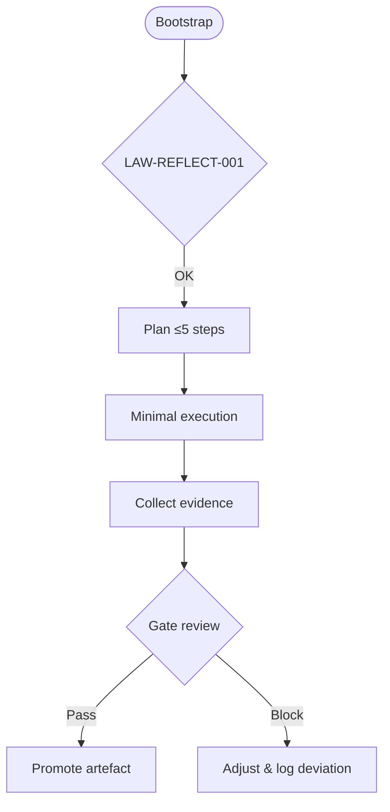

# 🌐 MCP Orchestration Framework (PoC)

> Customer-facing proof of concept that demonstrates a streamlined MCP-style control plane while keeping confidential implementation details private.

## ✨ Quick Highlights
- ✅ **Multi-task & multi-agent ready** – Python skeleton (`src/mcp_poc_framework`) registers several agents and routes work by skill.
- 🔌 **External AA integration** – HTTP adapter (`integrations/providers.py`) relies on environment tokens and can be extended to gRPC/WebSocket.
- 🧱 **Central SSoT** – `SSoTStateStore` captures assignments/results and aligns with JSONL logs for audits.
- 🔒 **Confidential by design** – only share strategic architecture; sensitive assets remain `REDACTED` and pass sanitize checks.
- 📊 **Evidence bundle** – agent logs, sanitize checklist, value-loop SVG, gate roadmap, and sample workflows.


## 🧭 Execution Flow


## 🧱 Repository Structure
| Folder | Key contents | Purpose |
| --- | --- | --- |
| `.agent/` | PoC policies, SoT linkage, sanitize checklist | Keeps alignment with global MCP guidance |
| *(runtime)* `.agents/` | Local-only agent logs & backlog (gitignored) | Keeps secrets outside the repo |
| `src/mcp_poc_framework/` | Multi-agent orchestration core | Heart of the framework |
| `configs/` | Provider/agent/task YAML samples | Separates sensitive runtime data |
| `docs/` | Customer docs (overview, API, value story) | Communicates value & guardrails |
| `memory/templates/` | Sanitised contract/template samples | Quick-start artefacts |
| `samples/` | Demo workflows, API walkthroughs, sample logs | Evidence of concept |
| `tools/` | Bootstrap + sanitize scripts | Enforces guardrails |

> 📁 Consult `docs/design/overview.md` and `plans/poc/ROADMAP.md` for additional detail.

## ⚖️ Strategic Snapshot
| Aspect | Strengths | Trade-offs |
| --- | --- | --- |
| Operations | ✅ Aligns with MCP laws (LAW-REFLECT-001, artefact must-haves) | ⚠️ Anchors disabled; needs full MCP infrastructure for production |
| Security | ✅ Sanitize script + checklist prevent leakage | ⚠️ CI pipelines disabled; enable before production |
| Scalability | ✅ Gate roadmap clarifies upgrade path | ⛔ No customer data integration yet |

## 🚧 Confidentiality Guardrails
- Share **architecture-level** information only; keep secrets/IP as `REDACTED`.
- Every brief/workflow under `docs/` and `samples/` must pass `tools/sanitize_manifest.py`.
- Promote from Gate G1→G3 before moving sensitive artefacts into private storage.

## 🛠️ Quickstart
```bash
# 1. Create PoC environment
python3 -m venv .venv && source .venv/bin/activate

# 2. Install tooling
pip install -r requirements.txt          # runtime & tests (httpx, pydantic, pytest)
# optional: pip install -r requirements-docs.txt  # mkdocs, ruff

# 3. Run PoC checks
python tools/sanitize_manifest.py --dry-run
./tools/bootstrap_orchestrator.sh --fast
```

- 🔁 **Dry-run only**: PoC never writes real anchors; updates stop at `memory/staged/`.
- 🧪 **Verification**: Runtime agents log to `.agents/logs/` (gitignored); see `samples/logs/` for sanitized examples.

## 📌 Evidence Bundle
- 📘 `docs/design/overview.md` – architecture & value stream.
- 🔌 `docs/design/api_integration.md` – API integration strategy.
- 🧾 `samples/logs/2025-10-24T150000Z.jsonl` – schema-aligned agent log sample.
- 🧰 `tools/sanitize_manifest.py` – sensitive-string detector.
- 🗺️ `plans/poc/ROADMAP.md` – Gate G0→G3 checklist.
- 🧱 `tech_fit.yaml` – architectural tech profile (redacted details).
- 🔄 `configs/providers.example.yaml` – sample provider/agent/task config.
- 💻 `samples/api_workflow.md` – orchestration walkthrough feeding the SSoT.
- 📁 `samples/templates/conflicts.example.yaml` – illustrative conflict log (keep real file local under `.agents/backlog/`).
- 🛡️ `docs/briefs/contribution_policy.md` – contribution workflow, auto-merge rules, and Copilot review guidance.
- 🤝 `docs/briefs/brainstorm_playbook.md` – structured process for agent-led brainstorming sessions.
- 🧠 `docs/briefs/brainstorm_lessons.md` – assumptions, mitigations, and Codex self-lessons for continuous improvement.
- 📜 `docs/briefs/project_charter.md` – vision, mission, strategy, success metrics, and 90-day plan.

## 🔭 Potential Applications
- **Multi-agent onboarding** – spin up coordinated teams using skill matrices.
- **Customer demonstrations** – showcase guardrails while mixing providers.
- **Product runway** – replace PoC state store & adapters for domain-specific launches.

## 🧩 Delivery Modality & Technology Choices
- **Primary form** – Python library plus lightweight CLI, optimised for DevOps/AA automation without imposing a fixed UI.
- **Contract-first inputs** – YAML workflows and JSONL evidence keep agents machine-friendly while humans consume Markdown briefs.
- **Integration-ready** – skeleton prepared to expose FastAPI/GraphQL endpoints for trigger orchestration or SSoT queries with minimal refactor.
- **Observability hooks** – structure ready for OpenTelemetry spans and structured logging so enterprise teams can plug into existing monitoring stacks.
- **Policy enforcement** – events are compatible with modern policy-as-code engines (OPA, Cedar) for automated guardrail decisions.

## 🔬 Emerging Enhancements Under Research
- **Event-driven orchestration** using async task queues (e.g., Celery, Arq) so multiple agents react to SoT deltas in real time.
- **Hybrid vector/relational memory** to promote lessons from STM → LTM with semantic search (pgvector, Milvus) while maintaining audit-friendly SQL snapshots.
- **Automated eval harnesses** inspired by LangSmith/LangGraph to grade reflection quality, incident response, and provider accuracy.
- **Guardrail automation** that fuses policy-as-code with LAW/META layers to pre-empt risky execution plans.
- **Human-in-the-loop UX** experiments (Next.js dashboard or VSCode extension) once the CLI proves adoption with pilot customers.

## 🤝 Upgrade Journey
1. **G0** – confirm scope & security (contract + checklist).
2. **G1** – enable lint/tests & mandatory artefacts.
3. **G2** – deliver end-to-end demo with transparent logs.
4. **G3** – shift to private repo, enable real anchors, negotiate delivery.

## 📬 Licensing & Contact
- PoC maintained by the MCP AI Operations team. Secrets are shared privately post-NDA.
- © 2025 MCP Operations — internal PoC license (view-only; no redistribution of proprietary techniques).
