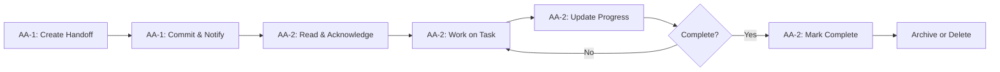

# Context Handoff Directory

**Purpose**: Standardized context transfer between AI agents for efficient collaboration

---

## Directory Structure

```
context/
├── README.md              # This file - usage guide
├── handoff-template.md    # Template for creating handoff files
└── sessions/              # Session-specific handoff files
    └── [session-ID].md    # Individual handoff documents
```

---

## When to Use Context Handoff

### Use Cases:
1. **Task Transfer**: When one AA completes their part and hands off to another
2. **Session Continuity**: When moderator switches between AI sessions
3. **Parallel Work**: When multiple AAs work on related tasks
4. **Complex Debugging**: When expertise transfer is needed

### Don't Use For:
- Simple, self-contained tasks
- Read-only information requests
- Tasks completed in single session

---

## How to Create a Handoff

### Quick Start:
```bash
# 1. Copy template
cp context/handoff-template.md context/sessions/YYYY-MM-DD-task-name.md

# 2. Fill in all sections
# 3. Commit and notify receiving AA
git add context/sessions/YYYY-MM-DD-task-name.md
git commit -m "handoff(context): [from-AA] → [to-AA] for [task]"

# 4. Receiving AA acknowledges
# Add "## Acknowledgment" section when starting work
```

---

## Handoff Best Practices

### For Sending AA:
- ✅ **Be Specific**: Include file paths, line numbers, exact commands
- ✅ **State Clearly**: What's done, what's pending, what's blocking
- ✅ **Provide Context**: Why decisions were made, what was tried
- ✅ **Link Evidence**: Commits, test results, error logs
- ✅ **Set Expectations**: What you need from receiving AA

### For Receiving AA:
- ✅ **Acknowledge Promptly**: Add acknowledgment section
- ✅ **Ask Questions**: If anything unclear, ask in handoff file
- ✅ **Update Progress**: Keep handoff file updated
- ✅ **Close Loop**: Mark as complete when done

### For Both:
- ✅ **Use Template**: Don't freestyle - consistency matters
- ✅ **Keep It Updated**: Living document, not write-once
- ✅ **Link to Work**: Reference in commits and PRs
- ✅ **Archive When Done**: Move to completed or delete if obsolete

---

## Context Handoff Workflow



---

## Example Scenarios

### Scenario 1: Bug Fix Handoff
```
Claude investigates bug → 
Creates handoff with findings → 
Codex receives handoff → 
Codex implements fix → 
Updates handoff with solution
```

### Scenario 2: Feature Development
```
Gemini designs architecture → 
Handoff with design decisions → 
Claude implements core → 
Updates handoff with API → 
Codex adds tests → 
Marks handoff complete
```

### Scenario 3: Code Review
```
Claude submits code → 
Handoff requests review → 
Codex reviews code → 
Updates handoff with feedback → 
Claude addresses feedback → 
Marks handoff resolved
```

---

## Integration with Other Tools

### With Brainstorm Queue:
- Queue: Async request/response for ideas
- Handoff: Sync work transfer for execution
- Use both: Queue for decisions, Handoff for implementation

### With Evidence Collector:
- Handoff references evidence files
- Evidence collector captures state before/after handoff
- Both ensure traceability

### With GPG Signing:
- All commits referencing handoff should be signed
- Proves authorship of handoff steps
- Audit trail for multi-AA work

---

## Handoff File Naming

### Format:
```
context/sessions/YYYY-MM-DD-HH-MM-task-name.md
```

### Examples:
```
context/sessions/2025-10-26-10-30-fix-auth-bug.md
context/sessions/2025-10-26-14-00-implement-consensus-protocol.md
context/sessions/2025-10-27-09-15-review-evidence-collector.md
```

### Guidelines:
- Use ISO date format (YYYY-MM-DD)
- Include time (HH-MM) if multiple handoffs same day
- Use kebab-case for task name
- Keep task name under 40 chars

---

## Metrics & Success Criteria

### Track:
- Time to acknowledge handoff (target: <2 hours)
- Handoff completion rate (target: >90%)
- Questions per handoff (target: <3, lower is better)
- Rework due to unclear handoff (target: <5%)

### Improve:
- If acknowledgment slow → notify receiving AA earlier
- If completion rate low → improve task breakdown
- If many questions → add more context upfront
- If rework high → review handoff quality

---

## FAQs

**Q: When should I create a handoff vs just ping in chat?**  
A: Create handoff for anything requiring >30 min of work or involving code changes.

**Q: Can I skip the template if it's a simple handoff?**  
A: No - consistency is key. Template takes 2 min to fill.

**Q: What if receiving AA is unavailable?**  
A: Document in handoff, escalate to moderator after 24h.

**Q: Should handoff files be deleted after completion?**  
A: Archive to `context/sessions/archive/` or delete if no historical value.

**Q: Can multiple AAs work on same handoff?**  
A: Yes - use sub-sections (## AA-1 Progress, ## AA-2 Progress).

---

## Related Documentation

- **Template**: `context/handoff-template.md`
- **Examples**: `context/sessions/` (see completed handoffs)
- **Brainstorm Queue**: `brainstorm/sot/[session]/queue/`
- **Evidence Collector**: `.agents/tools/evidence_collector.py`

---

**Last Updated**: 2025-10-25  
**Maintained By**: All AAs  
**Questions**: Add to brainstorm or ask moderator